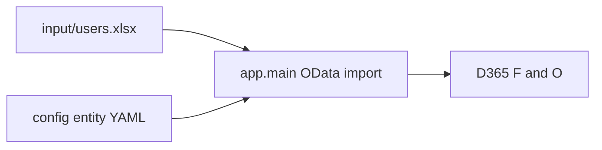

# D365 F&O System Users

Onboard users into **Dynamics 365 Finance and Operations** from a single Excel input file. The tool creates the worker record, the system user, links them together, and assigns the correct security roles (including legal-entity organization scope when configured)—all via **OData POST** to your environment.

## What this tool does

For each row in your input workbook, the import runs in this order:

1. **Employee (worker)** — `EmployeesV2`
2. **System user** — `SystemUsers`
3. **User ↔ worker link** — `PersonUsers` (unless you use `--skip-person-link`)
4. **Security roles** — `SecurityUserRoleAssociations` (when `SecurityRoles` is filled)
5. **Role organization scope** — `SecurityUserRoleOrganizations` (when legal-entity org columns are filled)

Column values and defaults come from YAML under [`config/`](config/). OData JSON property names are discovered from F&O at runtime (`$top=1` on each entity).



Existing employees, users, duplicate links, and role assignments are handled add-only: preflight and runtime checks skip what is already in the environment when possible.

## Prerequisites

Before you clone or configure this repository, ensure the following.

### Software and access

- **Python 3.10+** (recommended)
- Network access to your F&O environment URL (for example `https://your-env.operations.dynamics.com`)
- Permission in **Microsoft Entra ID** to register applications (or an admin who can register one for you)
- Permission in **F&O** to map Entra applications and to assign security roles to the service user

This tool authenticates with **OAuth 2.0 client credentials** (application ID + client secret). It does not sign in interactively as a human user.

### Microsoft Entra ID — register the application

Complete these steps once per integration app. Official background: [Service endpoints overview — Authentication](https://learn.microsoft.com/dynamics365/fin-ops-core/dev-itpro/data-entities/services-home-page#authentication).

1. Sign in to the [Microsoft Entra admin center](https://entra.microsoft.com) (or [Azure portal](https://portal.azure.com) → **Microsoft Entra ID**).
2. Go to **Applications** → **App registrations** → **New registration**.
3. Enter a **Name** (for example `D365FO System Users OData`).
4. Choose **Accounts in this organizational directory only** (single tenant) unless your organization requires otherwise.
5. Leave **Redirect URI** empty for client-credentials usage, then select **Register**.
6. On the app **Overview** page, copy and save:
   - **Application (client) ID** → use as `client_id` in [`config/d365_environments.yaml`](config/d365_environments.yaml)
   - **Directory (tenant) ID** → use as `tenant_id`
7. Go to **Certificates & secrets** → **New client secret** → add a description and expiry → **Add**. Copy the **Value** immediately (it is shown only once) → use as `client_secret`.
8. Go to **API permissions** → **Add a permission**.
9. Open **APIs my organization uses**, search for **`Microsoft Dynamics ERP`** (use the full name; a short search may show no results).
10. Select **Application permissions** (not Delegated) and enable the permissions your tenant requires for OData/service access to F&O. Many environments use permissions such as accessing Dynamics ERP data via the service API—match what your F&O administrator expects for server-to-server integration.
11. Select **Grant admin consent for [your tenant]** so the application permissions show a granted status.

You will paste `tenant_id`, `client_id`, and `client_secret` into `d365_environments.yaml` when you configure the repo.

### Dynamics 365 F&O — service user and Entra mapping

The Entra app must act in F&O **as a system user** with enough privileges to create workers, system users, person links, and security assignments.

1. **Create or choose an F&O system user** (recommended: a dedicated integration account, not a personal admin account):
   - In F&O, go to **System administration** → **Users** (path may appear under **Modules** depending on your shell).
   - Create a user with type suitable for service/automation use, or reuse an existing service account your organization approves.
2. **Assign security roles** to that user so OData POSTs succeed, including at minimum capabilities to:
   - Maintain **employees** (`EmployeesV2`)
   - Maintain **system users** (`SystemUsers`)
   - Create **person user** links (`PersonUsers`)
   - Assign **security roles** and **role organization** scope when your input file includes security columns  
   Exact role names vary by project (for example combinations of system administrator, security administrator, and HR/workforce roles). Work with your F&O functional consultant if POST calls return authorization errors.
3. **Register the Entra application in F&O**:
   - Go to **System administration** → **Setup** → **Microsoft Entra applications** (label may still show “Azure Active Directory applications” in some builds).
   - Select **New**.
   - **Client Id**: the Entra **Application (client) ID** from the previous section.
   - **Name**: a label for this registration (for example `System Users OData`).
   - **User ID**: the F&O user from step 1 (the account whose roles the app will use).
   - Save the record.
4. Note your environment URL (for example from LCS or the browser when signed in to F&O) → use as `environment_url` in `d365_environments.yaml`. Set `company` to the data area ID you use on OData requests (often your legal entity code, such as `USMF` or `1000`, depending on how your configs and environment are set up).

After this setup, you can verify connectivity with `--test-connection` once `d365_environments.yaml` is filled in (see **Configure the repository** below).

## Clone the repository

From PowerShell:

```powershell
git clone https://github.com/mrlopezco/D365FO-Users.git
cd D365FO-Users
```

If you already have the repo locally, pull the latest changes from your usual remote instead of cloning again.

## Configure the repository

### 1. Python environment

```powershell
python -m venv .venv
.\.venv\Scripts\pip.exe install -r requirements.txt
```

### 2. D365 environments (secrets)

Copy the example file and add your real values (including `client_secret`):

```powershell
Copy-Item config\d365_environments.example.yaml config\d365_environments.yaml
```

Edit [`config/d365_environments.yaml`](config/d365_environments.yaml). This file is **gitignored** and must not be committed.

Each environment entry needs at least: `name`, `environment_url`, `tenant_id`, `client_id`, `client_secret`, and optionally `company` (data area used on OData requests).

### 3. Input users workbook

Copy the template and edit the `Users` sheet (one row per person):

```powershell
Copy-Item input\users-example.xlsx input\users.xlsx
```

[`input/users.xlsx`](input/users.xlsx) is **gitignored**. Use [`input/users-example.xlsx`](input/users-example.xlsx) as the tracked template.

### 4. Entity defaults (optional)

Adjust company, language, employment dates, and other fixed fields without changing code:

| Config | OData entity |
|--------|----------------|
| [`config/employee_v2.yaml`](config/employee_v2.yaml) | `EmployeesV2` |
| [`config/user_information.yaml`](config/user_information.yaml) | `SystemUsers` |
| [`config/person_users.yaml`](config/person_users.yaml) | `PersonUsers` |
| [`config/security_user_role_association.yaml`](config/security_user_role_association.yaml) | `SecurityUserRoleAssociations` |
| [`config/security_user_role_organization.yaml`](config/security_user_role_organization.yaml) | `SecurityUserRoleOrganizations` |

Use `source` on a column to map from input sheet fields; use `odata_on_create: true` to send defaults on create. Override OData property names with `odata_property` if needed.

## Input columns

| Column | Maps to |
|--------|---------|
| `UserId` | User `USERID` (Employee `PERSONNELNUMBER` is left blank for F&O number sequence) |
| `Alias` | User `ALIAS` |
| `Email` | User `EMAIL` and Employee `PRIMARYCONTACTEMAIL` |
| `FirstName` | Employee `FIRSTNAME` (also builds display name) |
| `LastName` | Employee `LASTNAME` (also builds display name) |
| `SecurityRoles` | Optional. Comma-separated F&O role **display names** |
| `SecurityLegalEntityIds` | Optional. Comma-separated legal entity codes (e.g. `1000`) |
| `SecurityLegalEntities` | Optional. Comma-separated hierarchy types (e.g. `OPERATIONALLE`) |

If either org column is filled, **both** org columns must be filled. Leave all three security columns empty to create user and worker only (no role POSTs). Organization scope uses the Cartesian product of roles × legal entities × hierarchy types on that row.

Display name (`FirstName LastName`) fills User `USERNAME` and Employee `NAME` / `NAMEALIAS`.

Role names are resolved to identifiers via GET `SecurityRoles`.

## Run

### Interactive

From the project root:

```powershell
.\.venv\Scripts\python.exe -m app.main
```

You will be prompted to choose a configured D365 environment, then the import runs against `input/users.xlsx` by default.

### Test connection

```powershell
.\.venv\Scripts\python.exe -m app.main --environment TESTUSMF --test-connection
```

Replace `TESTUSMF` with the `name` from your `d365_environments.yaml`.

### Dry run (no POST)

```powershell
.\.venv\Scripts\python.exe -m app.main --environment TESTUSMF --input input\users-example.xlsx --dry-run --skip-preflight --yes
```

### Full import

```powershell
.\.venv\Scripts\python.exe -m app.main --environment TESTUSMF --input input\users.xlsx
```

After preflight, confirm unless you pass `--yes`.

### Useful flags

| Flag | Effect |
|------|--------|
| `--skip-person-link` | Skip `PersonUsers` (no user–worker link) |
| `--skip-security` | Skip role and organization assignment |
| `--skip-security-orgs` | Assign roles only; skip organization scope |
| `--yes` | Proceed without confirmation after preflight |
| `--skip-preflight` | Skip duplicate checks against the environment |
| `--verbose` | More detail on F&O errors and OData payloads |
| `--stop-on-error` | Stop after the first failed POST |
| `--dry-run` | Build payloads only; no POST (still connects for schema/roles when secrets are set) |
| `--config-dir` | Alternate folder for entity YAML (default: `config`) |
| `--input` | Alternate input workbook (default: `input/users.xlsx`) |

## Development and releases

Day-to-day work happens on the **`development`** branch. **`main`** stays stable and receives changes only through pull requests.

### Branch setup (first time)

After cloning, create and track the development branch (once the branch exists on GitHub, use `git checkout development` instead):

```powershell
git checkout -b development
git push -u origin development
```

### Typical workflow

1. Check out `development` and create a feature branch if you prefer:  
   `git checkout development`
2. Commit and push your changes to `development` (or open a PR from a feature branch into `development`).
3. When ready for a production-aligned release, open a **pull request from `development` into `main`**.
4. Review and **merge** the PR on GitHub.

### Automatic releases

When a pull request into **`main`** is **merged**, GitHub Actions ([`.github/workflows/release-on-merge.yml`](.github/workflows/release-on-merge.yml)) creates a **dated release**:

- First merge of the UTC day: `vYYYY.MM.DD` (example: `v2026.08.19`)
- Additional merges the same UTC day: `vYYYY.MM.DD.2`, `vYYYY.MM.DD.3`, …

The release uses GitHub’s auto-generated release notes from merged PRs. **Direct pushes to `main` do not create a release** — use a PR merge so the workflow runs.

## Help

```powershell
.\.venv\Scripts\python.exe -m app.main --help
```
